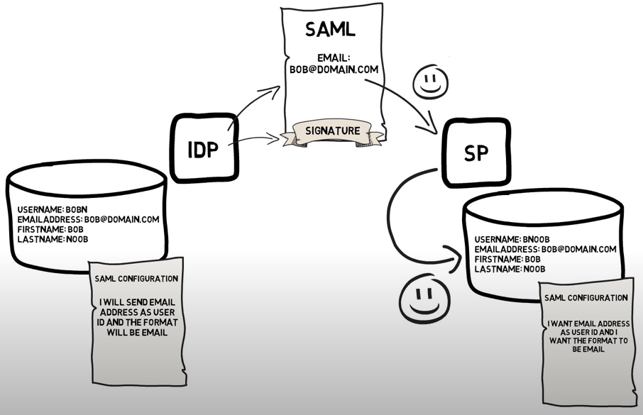
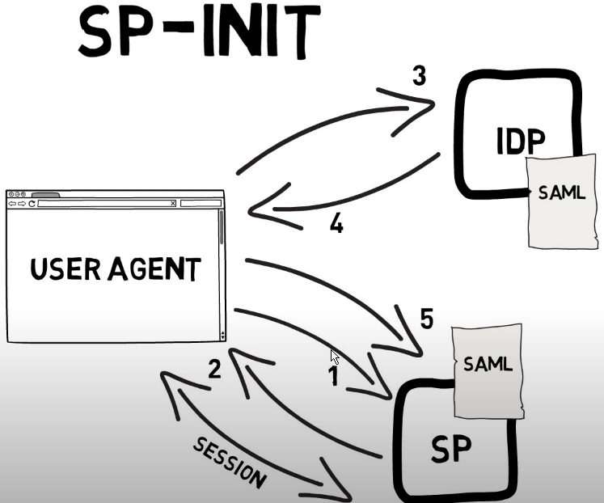
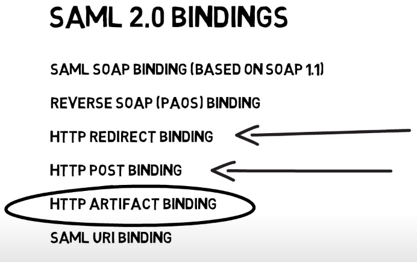

<aside class="notes">
?: Show keyboard shortcuts
Disable markdown plugin to export HTML
</aside>

<!--s-->

## Overview

<!--v-->

* Open standard {.fragment .fade-right}
* Support {.fragment .fade-right}
  * Authentication {.fragment .fade-right}
  * Authorization {.fragment .fade-right}
* XML-based markup language for security assertions {.fragment .fade-right}

<!--v-->

### History

* 2002 - v1.0: released by OASIS Security Services Technical Committee (SSTC)  {.fragment .fade-right}
* 2005 - v2.0: v1.0 +  Liberty Alliance extensions  {.fragment .fade-right}
* 2008: Extended usage in corporates {.fragment .fade-right}

<!--s-->

## Protocols

<!--v-->

| **Flow**                  | **Description**                           |
| ------------------------- | ----------------------------------------- |
| OAuth 2.0                 | Web Authorization Protocol                |
| OpenID Connect 1.0 (OIDC) | Simple identity layer on top of OAuth 2.0 |
| SAML 2.0                  | Security Assertion Markup Language        |

<!--s-->

## Actors and Roles

<!--v-->

| **Role**              | **OIDC**                                  | **SAML**                |
| --------------------- | ----------------------------------------- | ----------------------- |
| **End User**          | End User                                  | End User                |
| **Application**       | Relying Party (RP) + Resource Server (RS) | Service Provider (SP)   |
| **Identity Provider** | OpenID Provider (OP)                      | Identity Provider (IDP) |
| **Web Browser**       | User-Agent                                | User Agent              |

<!--s-->

### Tokens

<!--v-->

| **Token**          | **Format**             | **API protection UC** | **Validation**      |
| ------------------ | ---------------------- | --------------------- | ------------------- |
| **Access Token**   | Not defined, often JWT | REST & Bearer       | OAuth Introspection |
| **ID Token**       | JWT                    | REST & Bearer       | JSON Web Signature  |
| **SAML Assertion** | XML                    | SOAP & WS Security  | XML Signature       |

<!--s-->

## Flows

<!--v-->


<!--v-->



<!--v-->


<!--v-->


<aside class="notes">
* format of attributes
* Certificate
* Isssuer
* Supported bindings -> see below
</aside>

<!--v-->

### Initialization

<!--v-->


<aside class="notes">
equivalent to client-credentail flow
</aside>

<!--v-->



<aside class="notes">
equivalent to Authorization code flow
</aside>

<!--v-->

### SAML 2.0 BINDINGS

<!--v-->



<!--v-->

#### REDIRECT BINDING

* SAML protocol messages can be carried directly in the URL query string of an HTTP GET request

```
https://idp.example.org/SAML2/SSO/Redirect?SAMLRequest=fZFfa8IwFMXfBb9DyXvaJtZ1BqsURRC2
 Mabbw95ivc5Am3TJrXPffmmLY3%2FA15Pzuyf33On8XJXBCaxTRmeEhTEJQBdmr%2FRbRp63K3pL5rPhYOpkVdY
 ib%2FCon%2BC9AYfDQRB4WDvRvWWksVoY6ZQTWlbgBBZik9%2FfCR7GorYGTWFK8pu6DknnwKL%2FWEetlxmR8s
 BHbHJDWZqOKGdsRJM0kfQAjCUJ43KX8s78ctnIz%2Blp5xpYa4dSo1fjOKGM03i8jSeCMzGevHa2%2FBK5MNo1F
 dgN2JMqPLmHc0b6WTmiVbsGoTf5qv66Zq2t60x0wXZ2RKydiCJXh3CWVV1CWJgqanfl0%2Bin8xutxYOvZL18NK
 UqPlvZR5el%2BVhYkAgZQdsA6fWVsZXE63W2itrTQ2cVaKV2CjSSqL1v9P%2FAXv4C
```

<aside class="notes">
more common
equivalent to resource owner credentails flow
</aside>

<!--v-->

#### POST BINDING


<aside class="notes">
more common
equivalent to resource owner credentails flow
</aside>

<!--v-->

#### ARTIFACT BINDING


<aside class="notes">
more secure
equivalent to Authorization code flow
</aside>

<!--v-->


<aside class="notes">
define supported bindings
</aside>

<!--v-->

| **Protocol Flow**           | **Implementation** | **Backend Request**      | **PKCE** |
| --------------------------- | ------------------ | ------------------------ | -------- |
| **Authorization Code Flow** | Required           | Token Request            | Yes      |
| **SAML HTTP POST**          | Required           | –                        | –        |
| **Implicit Flow**           | Optional           | –                        | –        |
| **SAML Artifact**           | Optional           | Artifact Resolve Request | –        |

--

## SAML ASSERTION


<aside class="notes">
name id: user id
methods of authn: method and levelp of authn (SAML context classes: password, X509, Windows, Kerberos ...)
attributes: attributes formats ()
conditions: valid time of assertion, audienace
issuers id: who forge assertion
signature: HASH (integrity) + SIGN (origin)
</aside>

<!--v-->

``` xml
<saml:Assertion
   xmlns:saml="urn:oasis:names:tc:SAML:2.0:assertion"
   xmlns:xs="http://www.w3.org/2001/XMLSchema"
   ID="_d71a3a8e9fcc45c9e9d248ef7049393fc8f04e5f75"
   Version="2.0"
   IssueInstant="2004-12-05T09:22:05Z">
   <saml:Issuer>https://idp.example.org/SAML2</saml:Issuer>
   <ds:Signature
     xmlns:ds="http://www.w3.org/2000/09/xmldsig#">...</ds:Signature>
   <saml:Subject>
     <saml:NameID
       Format="urn:oasis:names:tc:SAML:2.0:nameid-format:transient">
       3f7b3dcf-1674-4ecd-92c8-1544f346baf8
     </saml:NameID>
     <saml:SubjectConfirmation
       Method="urn:oasis:names:tc:SAML:2.0:cm:bearer">
       <saml:SubjectConfirmationData
         InResponseTo="aaf23196-1773-2113-474a-fe114412ab72"
         Recipient="https://sp.example.com/SAML2/SSO/POST"
         NotOnOrAfter="2004-12-05T09:27:05Z"/>
     </saml:SubjectConfirmation>
   </saml:Subject>
   <saml:Conditions
     NotBefore="2004-12-05T09:17:05Z"
     NotOnOrAfter="2004-12-05T09:27:05Z">
     <saml:AudienceRestriction>
       <saml:Audience>https://sp.example.com/SAML2</saml:Audience>
     </saml:AudienceRestriction>
   </saml:Conditions>
   <saml:AuthnStatement
     AuthnInstant="2004-12-05T09:22:00Z"
     SessionIndex="b07b804c-7c29-ea16-7300-4f3d6f7928ac">
     <saml:AuthnContext>
       <saml:AuthnContextClassRef>
         urn:oasis:names:tc:SAML:2.0:ac:classes:PasswordProtectedTransport
       </saml:AuthnContextClassRef>
     </saml:AuthnContext>
   </saml:AuthnStatement>
   <saml:AttributeStatement>
     <saml:Attribute
       xmlns:x500="urn:oasis:names:tc:SAML:2.0:profiles:attribute:X500"
       x500:Encoding="LDAP"
       NameFormat="urn:oasis:names:tc:SAML:2.0:attrname-format:uri"
       Name="urn:oid:1.3.6.1.4.1.5923.1.1.1.1"
       FriendlyName="eduPersonAffiliation">
       <saml:AttributeValue
         xsi:type="xs:string">member</saml:AttributeValue>
       <saml:AttributeValue
         xsi:type="xs:string">staff</saml:AttributeValue>
     </saml:Attribute>
   </saml:AttributeStatement>
 </saml:Assertion>

```

<!--s-->

## Limitations

* **Mobile application** {.fragment .fade-right}

* **Devices and other “browser-less” use cases** {.fragment .fade-right}
*  **XML format** {.fragment .fade-right}

<aside class="notes">
there is no interoperability profile to support mobile applications. It could be possible to use SAML for the same use cases, but this often requires special purpose support from the Identity Provider.
</aside>

<!--s-->


<!--s-->


<!--s-->

## References

<!--v-->

* [SAML 2.0](https://en.wikipedia.org/wiki/SAML_2.0)
* [Compare](https://www.ubisecure.com/education/differences-between-saml-oauth-openid-connect/)

[](https://www.youtube.com/watch?v=SvppXbpv-5k)


<aside class="notes">
https://manpower2017blog.wordpress.com/2017/11/14/unification-de-lidentite-en-ligne-choisir-entre-oauth-saml-et-openid-connect/
https://en.wikipedia.org/wiki/Security_Assertion_Markup_Language
</aside>
